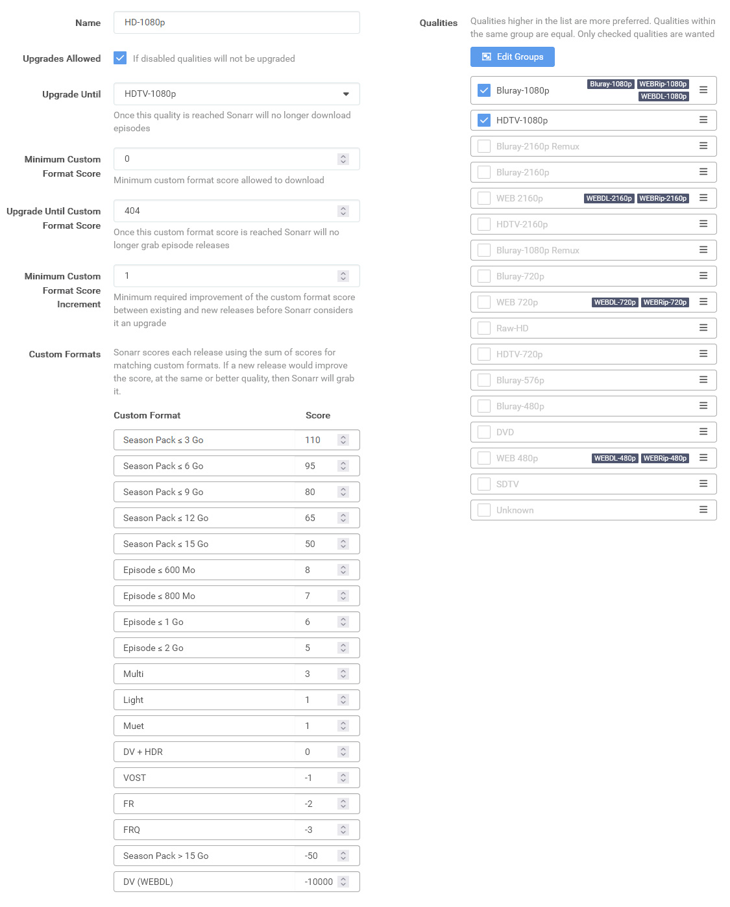

# arr-custom-formats
Mini guide pour grab et MAJ ses médias dans la version la plus légère, à ajuster pour la qualité souhaitée, avec des formats personnalisés et un profil unique sur Radarr et Sonarr.

<div style="background-color: #e5f8fb; border: 1px solid #448aff; border-radius: 4px; padding: 16px; margin: 16px; width: calc(100% - 32px); box-sizing: border-box;">
  Pour importer les <b>custom formats</b> ci-dessous, se référer aux TRaSH Guides suivant :<br>
  <b>Radarr :</b> <a href="https://trash-guides.info/Radarr/Radarr-import-custom-formats/" target="_blank">Créer</a> | <a href="https://trash-guides.info/Radarr/Radarr-how-to-update-custom-formats/" target="_blank">Mettre à jour</a><br>
  <b>Sonarr :</b> <a href="https://trash-guides.info/Sonarr/sonarr-import-custom-formats/" target="_blank">Créer</a> | <a href="https://trash-guides.info/Sonarr/sonarr-how-to-update-custom-formats/" target="_blank">Mettre à jour</a>
</div>

## Radarr

### Custom Formats

**DV (WEBDL)**<br>
Pour exclure les médias qui indiquent uniquement DV (Dolby Vision), non compatible avec mon matériel ou celui des personnes avec qui je partage ma bibliothèque.<br>
  ```sh
  {
  "name": "DV (WEBDL)",
  "includeCustomFormatWhenRenaming": false,
  "specifications": [
    {
      "name": "Dolby Vision",
      "implementation": "ReleaseTitleSpecification",
      "negate": false,
      "required": true,
      "fields": {
        "value": "\\b(dv|dovi|dolby[ .]?vision)\\b"
      }
    },
    {
      "name": "WEBDL",
      "implementation": "SourceSpecification",
      "negate": false,
      "required": false,
      "fields": {
        "value": 7
      }
    },
    {
      "name": "WEBRIP",
      "implementation": "SourceSpecification",
      "negate": false,
      "required": false,
      "fields": {
        "value": 8
      }
    },
    {
      "name": "Not RlsGrp",
      "implementation": "ReleaseGroupSpecification",
      "negate": true,
      "required": false,
      "fields": {
        "value": "\\b(Flights)\\b"
      }
    },
    {
      "name": "Not HDR",
      "implementation": "ReleaseTitleSpecification",
      "negate": true,
      "required": true,
      "fields": {
        "value": "\\bHDR(\\b|\\d)"
      }
    },
    {
      "name": "Not Hulu",
      "implementation": "ReleaseTitleSpecification",
      "negate": true,
      "required": false,
      "fields": {
        "value": "\\b(hulu)\\b"
      }
    }
  ]
}
  ```
<br>
<br>

**NOM**<br>
Descriptif<br>
  ```sh
  
  ```
<br>
<br>

**NOM**<br>
Descriptif<br>
  ```sh
  
  ```
<br>
<br>

**NOM**<br>
Descriptif<br>
  ```sh
  
  ```
<br>
<br>

**NOM**<br>
Descriptif<br>
  ```sh
  
  ```
<br>
<br>

**NOM**<br>
Descriptif<br>
  ```sh
  
  ```
<br>
<br>

**NOM**<br>
Descriptif<br>
  ```sh
  
  ```
<br>
<br>

**NOM**<br>
Descriptif<br>
  ```sh
  
  ```
<br>
<br>

**NOM**<br>
Descriptif<br>
  ```sh
  
  ```
<br>
<br>

**NOM**<br>
Descriptif<br>
  ```sh
  
  ```
<br>
<br>
<br>

### Profils

Voici un exemple des scores que j'ai appliqué uniquement sur HD-1080p, à adapter à ce que vous souhaitez :)<br>
<br>

<br>
<br>
<br>

## Sonarr

### Custom Formats

**NOM**<br>
Descriptif<br>
  ```sh
  
  ```
<br>
<br>

**NOM**<br>
Descriptif<br>
  ```sh
  
  ```
<br>
<br>

**NOM**<br>
Descriptif<br>
  ```sh
  
  ```
<br>
<br>

**NOM**<br>
Descriptif<br>
  ```sh
  
  ```
<br>
<br>

**NOM**<br>
Descriptif<br>
  ```sh
  
  ```
<br>
<br>

**NOM**<br>
Descriptif<br>
  ```sh
  
  ```
<br>
<br>

**NOM**<br>
Descriptif<br>
  ```sh
  
  ```
<br>
<br>

**NOM**<br>
Descriptif<br>
  ```sh
  
  ```
<br>
<br>

**NOM**<br>
Descriptif<br>
  ```sh
  
  ```
<br>
<br>

**NOM**<br>
Descriptif<br>
  ```sh
  
  ```
<br>
<br>

**NOM**<br>
Descriptif<br>
  ```sh
  
  ```
<br>
<br>
<br>

### Profils

Voici un exemple des scores que j'ai appliqué uniquement sur HD-1080p, à adapter à ce que vous souhaitez :)<br>
<br>

<br>
<br>
Have fun !


